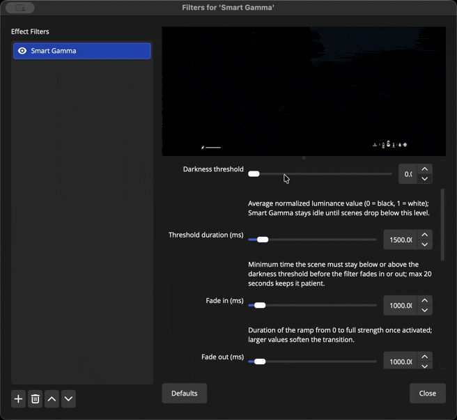

<div align="center">
<h1>Smart Gamma</h1>
<h3>Automatic brightness boost for dark scenes in OBS Studio</h3>

<picture>
  <source media="(prefers-color-scheme: dark)" srcset="./smart-gamma-logo.png">
  <source media="(prefers-color-scheme: light)" srcset="./smart-gamma-logo.png">
  
</picture>

[](https://github.com/mirkonz/smart-gamma/blob/main/LICENSE)

[](https://github.com/mirkonz/smart-gamma/releases/latest)

[](https://github.com/mirkonz/smart-gamma/releases)
</div>

## Smart Gamma — OBS Shader Filter
Smart Gamma is a single-pass GPU shader filter for OBS Studio. It samples scene luminance, applies gamma/brightness/contrast/saturation boosts when captures drop below a configurable threshold, and fades back as soon as things brighten up. The state machine drives everything through one `effect_strength` scalar, so the filter can stay idle without extra overhead.



### Key capabilities
- **Adaptive brightness modes:** Auto brightness (default) scales effect strength smoothly as scenes drop below the darkness threshold, while Threshold fade keeps the manual trigger/hold/fade workflow when you need strict holds.
- **Unified parameter schema:** Darkness thresholds, fade envelopes, gamma/brightness/contrast, and optional saturation live in the same schema so the UI, localization, docs, and defaults never drift apart.
- **Single-pass GPU work:** All adjustments stay inside one shader with no per-frame heap churn and no readbacks larger than 32×32, so the filter typically costs ~0.1 ms per frame at 1080p.

### Design notes
- **Smooth transitions:** Configurable fade-in/out curves and debounced thresholds prevent flicker during HUD flashes or sudden highlights.
- **Cross-platform presets:** The same CMake project delivers Apple Silicon/Intel macOS bundles, Windows 64-bit plug-ins, and Ubuntu binaries via presets that match CI.
- **Schema-driven docs:** `parameter_schema.hpp` powers runtime behaviour, localization strings, and documentation to keep terminology and defaults consistent.

## Platforms & Requirements
Smart Gamma supports the same environments as modern OBS installations with shader filters enabled.

- **Supported OS:** macOS 13+ (Intel & Apple Silicon), Windows 10/11 64-bit.
- **OBS Studio:** 30.1 or newer (needs the modern libobs shader stack).
- **GPU:** Any device that keeps OBS shader filters enabled.
- **License:** MIT (see `LICENSE`).

## Parameter Reference
Parameters are defined once in [`include/smart-gamma/parameter_schema.hpp`](include/smart-gamma/parameter_schema.hpp) and documented in [`docs/parameters.md`](docs/parameters.md). These values are reused in code, the UI, and the docs to keep everything DRY.

| Setting | Default | Notes |
| --- | --- | --- |
| Mode | `Auto brightness` | Auto brightness scales the effect based on how far below the threshold the scene sits. Switch to Threshold fade to restore the original trigger → hold → fade behavior (and reveal the timing sliders). |
| Darkness threshold | `35%` | Average normalized luminance (expressed as a percentage between black and white) required before Auto brightness begins scaling or Threshold fade can trigger. |
| Threshold duration (ms) | `600` | Time the scene must stay below (to fade in) or above (to fade back out) the darkness threshold before Smart Gamma reacts; available only in Threshold fade mode. |
| Fade in (ms) | `200` | Duration of the fade from 0 to full strength once active (Threshold fade mode). |
| Fade out (ms) | `450` | Duration of the fade when returning to normal brightness (Threshold fade mode). |
| Gamma boost | `1.20` | Gamma multiplier at full strength; Auto brightness ramps toward this as the scene darkens. |
| Brightness offset | `0.10` | Linear brightness offset (use small values to avoid clipping); represents the maximum offset applied when the scene is black. |
| Contrast | `1.10` | Contrast gain to keep highlights alive after the gamma boost at full strength. |
| Saturation | `1.00` | Optional saturation multiplier applied as the effect strength rises. |

### Using Smart Gamma
- **Default behavior:** Auto brightness reads the smoothed luminance, compares it to the darkness threshold, and scales `effect_strength` between 0 and 1 as the scene darkens. When the scene is pitch black you reach the exact gamma/brightness/contrast/saturation values configured, and brighter scenes only get a proportional subset so things never blow out. Switch the Mode dropdown to Threshold fade if you prefer the binary on/off behavior with activation delays and explicit fade times.
- **Slider guidance:** Lower the darkness threshold to reserve the boost for truly dark scenes or raise it to catch dim but not fully black footage. Enable "Show detected brightness" if you want a read-only indicator above the slider showing the current averaged luminance percentage, making it easy to align the threshold with live footage. Threshold Duration + Fade In/Out only apply to Threshold fade mode; leave them at their defaults (or hide them entirely) when you stick with Auto brightness. Gamma/Brightness/Contrast/Saturation represent the maximum correction applied when `effect_strength` hits 1, so dial them the way you want pure-black scenes to look.

## How It Works
1. **Luminance probe:** Each frame the filter downsamples the source texture to 32×32 on the GPU, stages that tiny texture once, and computes the Rec.709 luminance average. An exponential moving average (α = 0.18) keeps the signal stable.
2. **Effect strength logic:** Auto brightness maps the smoothed luminance to a proportional `effect_strength` once the scene dips below the threshold, while the Threshold fade mode keeps the IDLE → WAITING → FADING_IN → ACTIVE → FADING_OUT state machine for users who prefer explicit hold timers. Threshold crossings during fades behave gracefully (brightening in FADING_IN immediately pivots to FADING_OUT, etc.).
3. **Shader blend:** The shader file at `data/shaders/smart-gamma.effect` applies gamma/brightness/contrast/saturation adjustments and lerps with the original frame based on `effect_strength`. Strength 0 returns the untouched frame; strength 1 applies the full correction.

## Building from Source
Smart Gamma mirrors the official [obs-plugintemplate](https://github.com/obsproject/obs-plugintemplate) layout. `buildspec.json` pins the OBS/libobs + dependency revisions and the helper modules in `cmake/` wire them up automatically, so building only requires choosing the preset that matches your host OS. The first configure run downloads everything into `.deps/`.

### macOS (Xcode 16+)
```bash
cmake --preset macos
cmake --build --preset macos
cmake --install build_macos --config RelWithDebInfo
```
The preset emits a universal `smart-gamma.plugin` bundle. macOS defaults install directly into `~/Library/Application Support/obs-studio/plugins`, and the install step also generates a distributable `smart-gamma.pkg` alongside the prefix. Use `scripts/link-macos.sh` only if you install elsewhere and still want a symlink back into the OBS plug-ins folder.

### Windows (Visual Studio 2022)
```powershell
cmake --preset windows-x64
cmake --build --preset windows-x64 --config RelWithDebInfo
cmake --install build_x64 --config RelWithDebInfo --prefix dist/windows-x64
```
This preset configures the right toolset, pulls obs-deps + Qt6, and installs into `dist/windows-x64/smart-gamma`. Copy that tree into `%ProgramData%/obs-studio/plugins` or your OBS install directory.

### Ubuntu 24.04 / Linux
```bash
cmake --preset ubuntu-x86_64
cmake --build --preset ubuntu-x86_64
cmake --install build_x86_64 --prefix dist/linux-x86_64
```
Linux builds use Ninja with `RelWithDebInfo` and install the `.so` into `dist/linux-x86_64/lib/obs-plugins` plus data under `share/obs/obs-plugins/smart-gamma`.

### Tips
- Need automation-friendly settings? Use the `macos-ci`, `windows-ci-x64`, or `ubuntu-ci-x86_64` presets to enable warnings-as-errors and ccache.
- Flip `-DENABLE_FRONTEND_API=ON` / `-DENABLE_QT=ON` if you add UI bits; the helper modules will locate the extra SDKs.
- Delete `.deps/` to force a clean dependency download between OBS releases.

### Packaging
- macOS: the install step already emits `smart-gamma.pkg`; wrap it in a DMG with `scripts/create-dmg.sh "<install-prefix>" dist/smart-gamma-macos.dmg` if desired.
- Windows: install [NSIS](https://nsis.sourceforge.io/Download) (so `makensis` is on `PATH`) and run `powershell ./scripts/create-windows-installer.ps1 -SourceDir dist/windows-x64 -OutputExe dist/smart-gamma-windows.exe -ProductVersion <semver>`. The script feeds the payload to NSIS, which emits a standard wizard that defaults to `%ProgramData%/obs-studio/plugins/smart-gamma` and offers a directory picker + uninstaller entry.
- Any platform: `scripts/package.sh <build-dir> <platform-tag> [output-dir]` zips an install tree (e.g., `scripts/package.sh build_x86_64 linux-x86_64 dist`).

## Testing Checklist
Create three quick OBS scenes to validate behaviour.
- **Dark gameplay:** mostly black gameplay footage, confirm activation delay + fade-in feel smooth.
- **Mixed lighting:** capture with flashing HUDs to ensure smoothing avoids flicker.
- **Strobe/Explosions:** verify fade-out path keeps up with rapid brightness spikes.
Monitor the OBS stats dock; Smart Gamma should stay under 0.1 ms/frame at 1080p on modern GPUs.

## Continuous Integration
Template-driven workflows under `.github/workflows/` (`push.yaml`, `pr-pull.yaml`, `dispatch.yaml`, and helpers) call into `build-project.yaml` and `check-format.yaml`, so CI reuses the exact presets listed above to fetch dependencies, build macOS/Windows/Ubuntu artifacts, and run clang-format + gersemi.

## Roadmap
See [`plan.md`](plan.md) for future shader-focused tasks (per-source profiles, calibration wizard, HUD masking, ML experiments, etc.). Feel free to PR improvements there.
